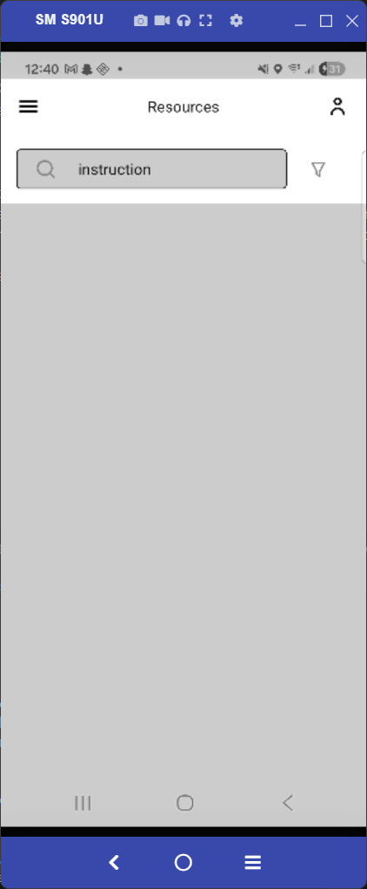
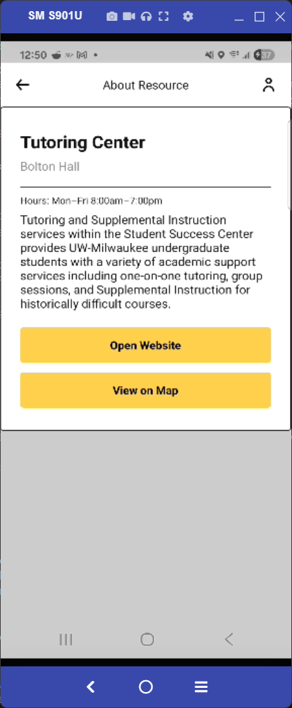
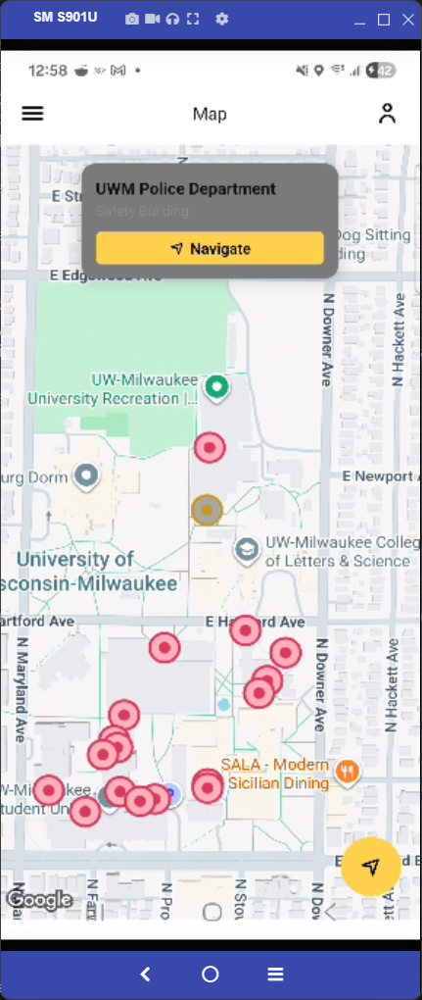
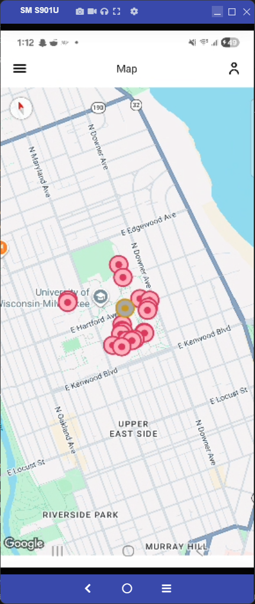
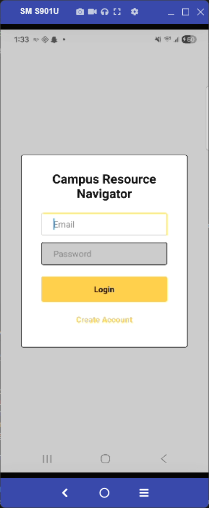
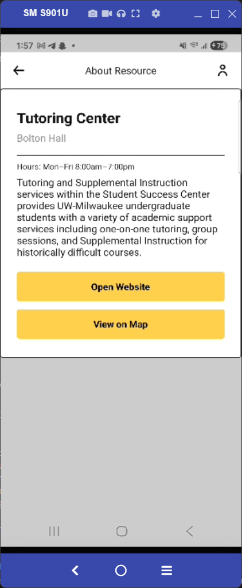
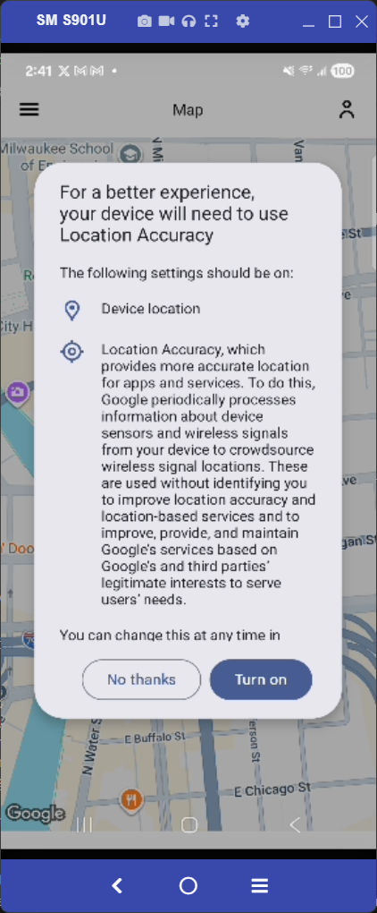
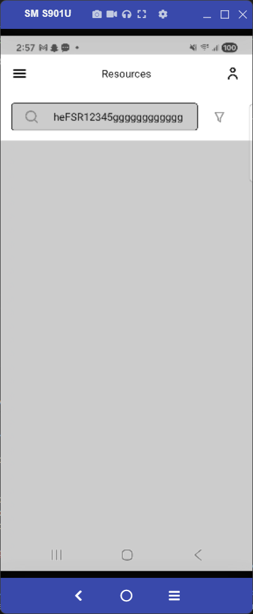

[SCRUM-63] Keyword Depth Search (Directory)

PASS [Y]
Steps:
1. Navigate to the Directory screen.
2. Enter a keyword that exists only in the resource description (e.g., "instruction").
3. Observe the results list (tutoring should be displayed).

External Link Tab Persistence
PASS [Y]
Steps:
1. Navigate to the Directory screen.
2. Open any event (like the Tutoring Center).
3. Tap "Open Website".
4. Navigate back to app from website.
5. Observe if app is open.

Map Marker Detail Info Windows
PASS [Y] 
Steps:
1. Navigate to the Map.
2. Tap on any event pin.
3. Observe window showing the name, location, and a clickable link.

Fallback For Map Navigation Without Location Permissions
PASS [N]
Steps:
1. Navigate to phone's system settings.
2. Disable Location Permissions.
3. Open CRN app.
4. Navigate to the map.
5. Click on pin
6. Click on navigate in the pop up window.
7. Observe pop up for manual starting location.

Guest Access 
PASS [N]
Steps:
1. Access app as an unauthenticated user (guest).
2. Navigate to directory.
3. Search for an event.
4. Click on event.
5. Observe details of event.
6. Navigate to rest of pages using the hamburger button.
7. Observe if you can access each page.

Feedback Restriction
PASS [N]
Steps:
1. Access app as an unauthenticated user (guest).
2. Navigate to events page.
3. Search for an event.
4. Click on event. 
5. Observe leave review buttons missing.
6. Login as admin.
7. Navigate to directory.
8. Create a new event
9. Observe new event.
10. Edit an event.
11. Observe edited event. 
12. Click on a event that has been reviewed.
13. Observe review.

Resource Review and Rating System
PASS [N]
Steps: 
1. Login as a student.
2. Navigate to directory.
3. Search for an event.
4. Click on event.
5. Observe Leave Review and Rating buttons.
6. Navigate to leave review.
7. Enter feedback in text area.
8. Submit review.
9. Observe result.

Admin Event Creation Using Minimum Fields 
PASS [N]
Steps: 
1. Login as admin.
2. Navigate to directory.
3. Click on create event.
3. Create event with only a title.
4. Observe that the event was not created with an error message.

Event Date Validation 
PASS [N]
Steps:
1. Login as admin. 
2. Navigate to directory.
3. Click on create a new event.
4. Set the start time of the event to some date in the past and create it.
5. Observe that the event wasnt created with an error message.

Automated Event Expiration
PASS [N]
Steps:
1. Navigate to map
2. Locate a pin that will expire soon
3. Wait until the event expires.
4. Refresh the map.
5. Observe pin is removed from map.

Map Filter
PASS [N]
Steps:
1. Navigate to map.
2. Observe that all pins are visible by default.
3. Open the filter menu and deselect a category.
4. Observe pins from deselected category are not visible.

Usage Reporting For Admin
PASS [N]
Steps:
1. Login as admin.
2. Navigate to usage reports.
3. Observe data on underutilized campus services based on logged usage.

Location Permission Request
PASS [Y]
Steps:
1. Navigate to phone settings.
2. Navigate to location settings.
3. Disable location permissions.
4. Open app.
5. Navigate to Map
6. Observe window pop up that request's the user permission to access their location data.

100 Char Limit For Search Bar
Pass[N]
Steps:
1. Navigate to directory.
2. Click on search bar.
3. Enter text over 100 chars.
4. Observe that you cant enter more text.

