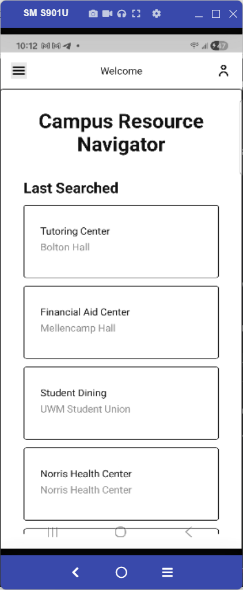
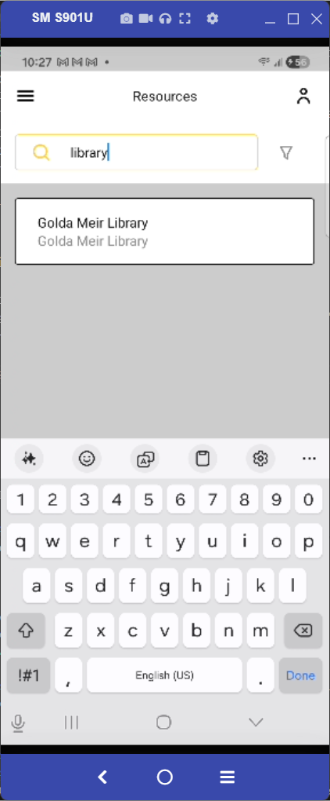
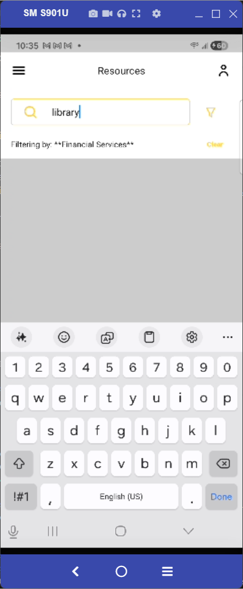
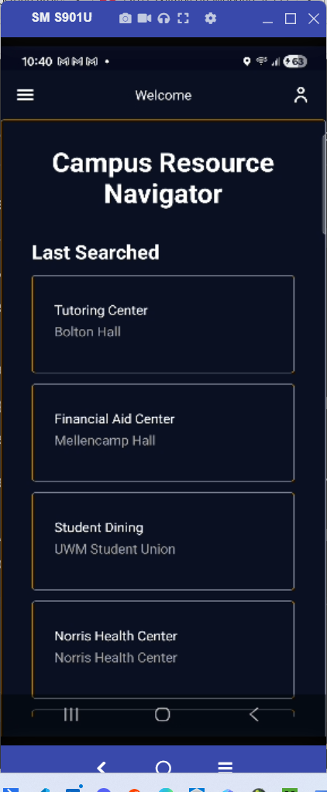
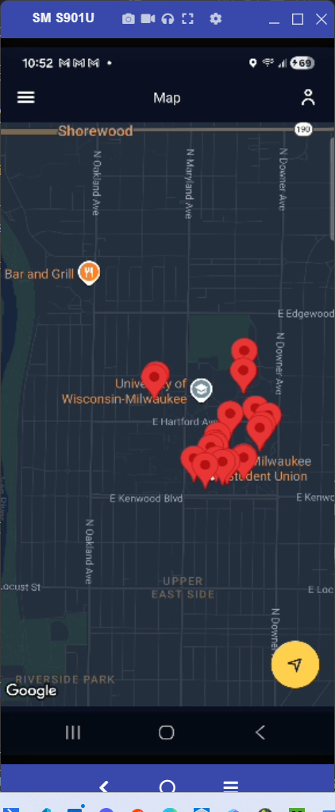

[SCRUM-48] Home Page "Last Searched" Update

PASS [N]
Steps:
1. Navigate to the Directory/Resources screen.
2. Search for a specific resource (e.g., "UWM Police Department").
3. Click on the result to view details.
4. Navigate back to the Home screen.
5. Observe the "Last Searched" list.

PASS [Y]
Directory Search Filtering
Steps:
1. Navigate to the Directory screen.
2. Tap the search bar and type a keyword (e.g., "library").
3. Observe the list results.

PASS [Y]
Directory Category Filter Exclusion
Steps:
1. Navigate to the Directory screen.
2. Enter a search term (e.g., "library").
3. Apply a filter that does not match the resource (e.g., "Financial Services").
4. Observe the results list.

PASS [Y]
System Dark Mode Responsiveness
Steps:
1. Open the app on a mobile device/emulator.
2. Toggle the system setting from Light Mode to Dark Mode.
3. Observe the app's UI.

PASS [Y]
Map Theme Integration
Steps:
1. Navigate to the Map screen.
2. Toggle the system setting to Dark Mode.

PASS [Y]
Map Gesture Interactivity (Pinch-to-Zoom)
Steps:
1. Navigate to the Map screen.
2. Use two fingers to pinch in and out on the map surface.

PASS [Y]
Map Marker Visibility (UWM Locations)
Steps:
1. Navigate to the Map screen.
2. Cross-reference markers with the Directory list.

