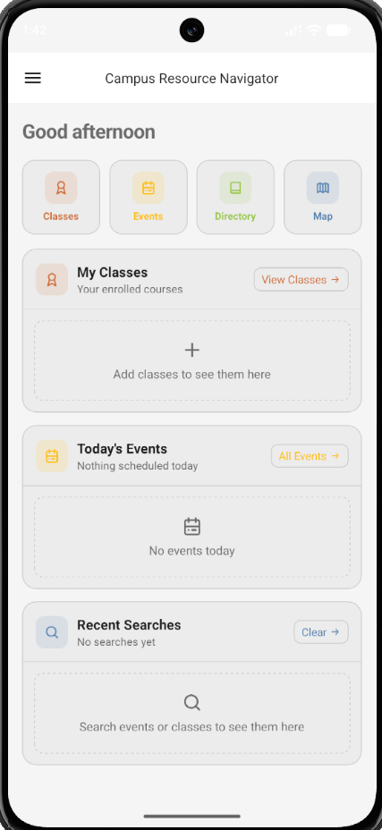
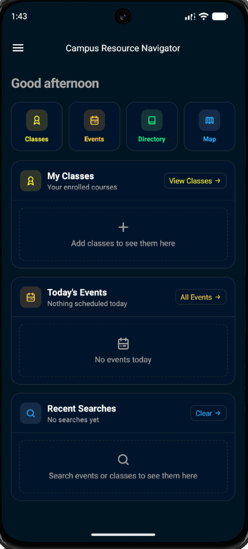
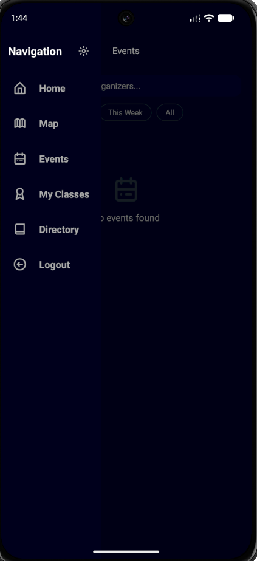

# Campus Resource Navigator (CRN)

A React Native mobile application developed as a capstone project to help students discover campus resources, explore events, search academic information, and navigate campus services from one mobile-friendly interface.

## Overview

Campus Resource Navigator is designed to make university life easier by bringing important student resources into a single app experience. Instead of digging through multiple websites or disconnected systems, students can use CRN to find campus locations, browse resources, view events, and access academic tools from a centralized mobile interface.

## Features

- Campus resource directory
- Resource detail pages
- Campus map integration
- Event browsing and event details
- Class search and class detail views
- Saved/enrolled classes context
- Account screen
- Side menu navigation
- Light and dark theme support
- Mobile-first interface built with reusable React Native components

## Tech Stack

- React Native
- Expo
- TypeScript
- React Navigation
- UI Kitten
- Eva Design System
- React Native Maps
- Auth0
- AsyncStorage
- Context API
- Jest
- Deno
- GitHub Actions
- PostgreSQL

## Project Structure

```text
CRN/
├── App.tsx
├── src/
│   ├── context/
│   ├── navigation/
│   ├── screens/
│   └── theme/
├── android/
├── package.json
└── README.md
```

## My Contributions

My work focused on testing, automation, data tooling, database design, and project reliability.

- Wrote manual test cases to validate app behavior and support capstone QA efforts
- Set up GitHub Actions workflows using Deno for automated checks
- Added linting support to improve code quality and maintain consistency across the project
- Built data collection scripts to gather UWM campus resource and event information for use in the app
- Created database maintenance scripts to remove stale or outdated PostgreSQL records
- Designed the database schema for the events table
- Worked with Jest for backend and application testing
- Explored Detox for end-to-end mobile testing, but could not fully integrate it due to conflicting backend runtime requirements
- Debugged Android, Expo, Java, Gradle, dependency, and emulator setup issues while preparing the project for portfolio presentation

## Running the Project

Clone the repository:

```bash
git clone https://github.com/lupenox/CRN---fork.git
cd CRN---fork/CRN
```

Install dependencies:

```bash
npm install
```

Start the development server:

```bash
npx expo start
```

Run on Android:

```bash
npx expo run:android
```

For development builds:

```bash
npx expo start --dev-client
```

## Screenshots

### Home Screen

<p align="center">
  
</p>

### Dark Mode

<p align="center">
  
</p>

### Navigation Menu

<p align="center">
  
</p>

## Status

This project was developed as part of a university capstone course. Additional polish and documentation are being added as the project is prepared for portfolio use.

## License

This project is for educational and portfolio purposes.
